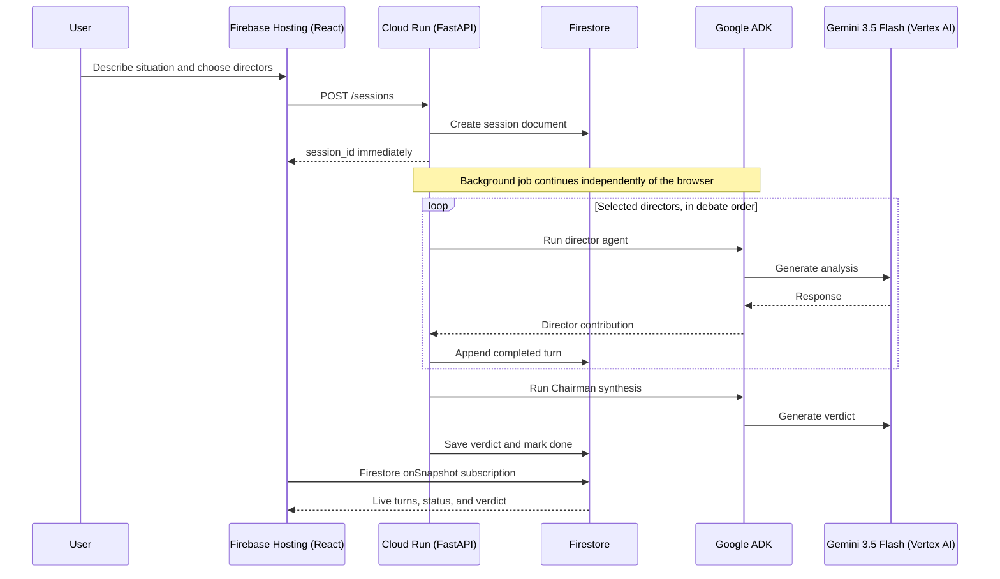

# Architecture

The submitted visual architecture diagram is also available as
[`output/pdf/junta-directiva-architecture.pdf`](../output/pdf/junta-directiva-architecture.pdf).

**Junta Directiva AI** is a Collaborative Partner that keeps working after the
browser receives its answer: a board session is created immediately, then 12
specialist agents and a Chairman deliberate asynchronously in Google Cloud.
The user watches each completed contribution appear in real time.

## Sequence

## Components

- **Firebase Hosting frontend** — React/Vite gathers the situation, optional
  document/URL/note context, meeting type, and director selection. It creates
  one session then subscribes to Firestore; it never calls Gemini directly.
- **Cloud Run backend** — FastAPI exposes `POST /sessions`, `/context`, and
  `/coach`. Every AI request uses the Cloud Run service account; the experience
  is free and unrestricted for judging, with no API-key or payment flow.
- **Google ADK + Vertex AI** — 12 director agents, the Chairman, document
  summaries, full reports, and follow-up questions all use `gemini-3.5-flash`
  through Vertex AI.
- **Firestore** — persists sessions, completed turns, verdicts, and pause state.
  The live subscription keeps the interface updated while work happens in the
  background.

## Hackathon compliance

| Requirement | Implementation |
|---|---|
| Gemini 3.5+ | `gemini-3.5-flash` via Vertex AI |
| Google agent framework | Google ADK agents + `InMemoryRunner` |
| Google Cloud services | Cloud Run, Firestore, Firebase Hosting |
| Beyond a chat loop | `POST /sessions` returns first; the board continues server-side and persists progress |
| Collaborative Partner | Clarifying context, guided decision flow, director selection, a follow-up Chairman conversation, and a full report |
