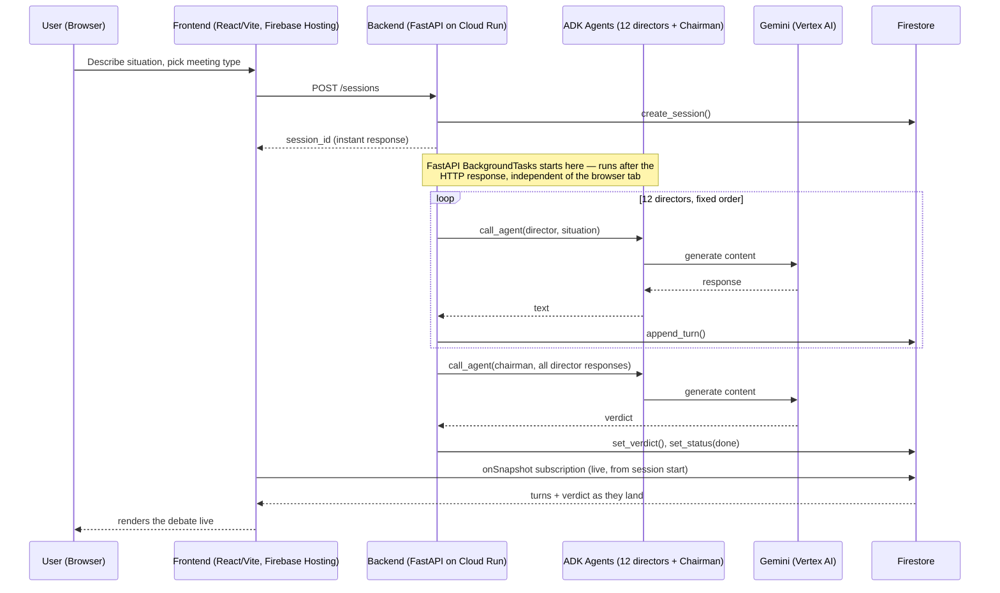

# Architecture

**Junta Directiva AI** runs the board debate as a genuine background job, not a
chat-loop reskin: the browser gets a `session_id` back immediately, and the
12-director-plus-chairman sequence keeps running server-side whether or not
the tab stays open. For this board-convening flow, the frontend never talks
to the LLMs directly — it only creates a session and then watches Firestore.
(Two other, non-judged UI features — the post-verdict report and the
chairman follow-up chat — depended on an LLM endpoint that doesn't exist in
this backend, and have been removed from this build's UI; see "Known gaps"
below.)

## Sequence

## Components

- **Frontend** — React 18 + Vite, deployed to Firebase Hosting. Calls
  `POST /sessions` once via `frontend/src/lib/firestoreClient.js`, then opens
  a Firestore `onSnapshot` subscription on the session document and renders
  whatever turns/verdict/status are in it. For the board-convening flow it
  never polls the backend and never calls Gemini or Vertex AI directly
  (see "Known gaps" below for the two features that used to).
- **Backend** — FastAPI on Cloud Run (`backend/main.py`). `POST /sessions`
  creates the Firestore doc and hands the whole debate off to FastAPI's
  `BackgroundTasks` (`backend/orchestrator.py::run_board_session`), then
  returns `{session_id}` right away. `GET /sessions/{id}` returns the current
  session document (used for any direct polling/debugging, though the
  frontend relies on the Firestore subscription instead).
- **Orchestrator** (`backend/orchestrator.py`) — runs the 12 director agents
  in a fixed order, then the chairman, persisting each director's response to
  Firestore as soon as it lands (`append_turn`), and finally writing the
  chairman's synthesis (`set_verdict`) and flipping `status` to `done`.
- **ADK agents**
  - `backend/agents/directors.py` defines `DIRECTORS` (12 personas ported
    verbatim from the original product's `directors.js`) and
    `build_director_agent(director)`, which wraps each persona's system
    prompt as an ADK `Agent` on `gemini-2.5-flash`.
  - `backend/agents/chairman.py` defines `build_chairman_agent()`, which uses
    a dedicated verdict-synthesis prompt (`CHAIRMAN_SYSTEM_PROMPT`) — this is
    *not* one of the 12 director personas re-used, it's a separate prompt
    whose only job is to read the full debate and produce consensus points,
    the main disagreement, a final verdict, and next steps.
- **LLM call path** (`backend/orchestrator.py::call_agent`) — each agent call
  builds a `google.adk.runners.InMemoryRunner` (bundles an in-memory ADK
  session service with a `Runner`), creates an ADK session, and drives it
  with `Runner.run()` (the synchronous variant), scanning the yielded events
  for `event.is_final_response()` to pull out the agent's final text. This
  runs 13 times per board session (12 directors + chairman), each with its
  own runner/session — verified against the installed `google-adk==2.6.3`
  package directly, not assumed from older docs. `call_agent` is kept as a
  standalone function specifically so tests can mock it without touching
  ADK/Vertex AI.
- **Firestore** (`backend/firestore_store.py`) — one document per session in
  a `sessions` collection: `{situation, meeting_type, status, turns[],
  verdict, created_at}`. `status` moves `running → done`. All Gemini calls
  happen with the Cloud Run service account's credentials
  (`GOOGLE_APPLICATION_CREDENTIALS` / Application Default Credentials) — no
  API key is ever sent to or held by the browser.

## Known gaps

Two UI features outside the board-convening flow described above — the
post-verdict "informe completo" report (`ReportModal`/`DownloadBanner`) and
the chairman follow-up chat (`ChairmanChat`) — depended on a client-side
`fetch('/api/coach', ...)` endpoint that does not exist in this backend
(only `/health`, `/sessions`, `/sessions/{id}`), so they have been removed
from the rendered UI for this competition build rather than shipped broken;
the component/hook files remain in the tree for the underlying product.

## What the competition build deliberately does not have

This build narrows the underlying product on purpose, to keep the surface
area small and unambiguous for judging:

- No BYOK / API-key UI. Every Gemini call is server-side, authenticated via
  the Cloud Run service account.
- No director-selection picker. All 12 directors always convene, in the
  fixed order defined by `DIRECTORS` in `backend/agents/directors.py`.
- No pause/resume. A session runs start to finish once created.

## Where GCP services are used

| Requirement | How this repo satisfies it |
|---|---|
| Gemini via Vertex AI | `backend/agents/directors.py` / `chairman.py` build ADK `Agent`s on `gemini-2.5-flash`; `google-cloud-aiplatform` in `backend/requirements.txt` |
| Google agent framework | Google ADK (`google-adk`), via `google.adk.Agent` + `google.adk.runners.InMemoryRunner` |
| GCP infra service(s) | Cloud Run (backend, see `backend/Dockerfile`) + Firestore (`backend/firestore_store.py`) |
