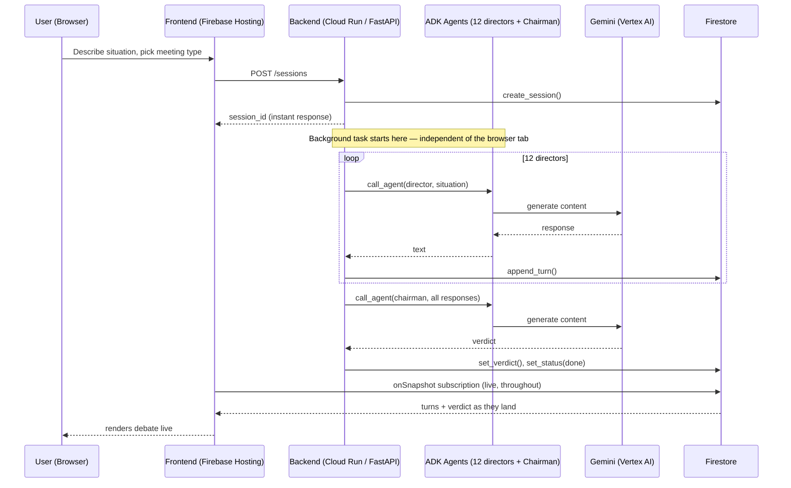

# Junta Directiva AI — All Things Agentic Hackathon Implementation Plan

> **For agentic workers:** REQUIRED SUB-SKILL: Use superpowers:subagent-driven-development (recommended) or superpowers:executing-plans to implement this plan task-by-task. Steps use checkbox (`- [ ]`) syntax for tracking.

**Goal:** Rebuild "Junta Directiva AI" (12 AI board-of-directors agents that debate a user's situation and issue a verdict) as a compliant, competitive entry for the **Collaborative Partner** track of the All Things Agentic Hackathon — a genuinely asynchronous, background-running agent, not a chat-loop reskin.

**Architecture:** React/Vite frontend (Firebase Hosting) creates a session against a Cloud Run FastAPI backend. The backend uses **Google ADK** to orchestrate 12 director agents + 1 chairman-synthesis agent, each calling **Gemini via Vertex AI**, writing every turn to **Firestore** as it completes. The frontend no longer streams HTTP responses — it subscribes to the Firestore session document in real time. This makes "runs in the background, independent of the browser tab" structurally true, not just a claim in the README.

**Tech Stack:**
- Frontend: React 18 + Vite (reused from existing repo) + Firebase Hosting
- Backend: Python 3.12 + FastAPI on Cloud Run
- Agent framework: Google ADK (`google-adk`)
- LLM: Gemini 2.5/3.5 Flash via **Vertex AI** (`google-cloud-aiplatform`) — not raw API key, so Cloud Run's service account handles auth, nothing exposed client-side
- State/persistence: Firestore, Native mode (`google-cloud-firestore`)
- i18n: lightweight custom dictionary + React context (no library needed for a 2-language toggle)

## Global Constraints (from official hackathon rules — verbatim values)

- Submission deadline: **August 31, 2026, 5:00pm PDT**. Build with buffer — target internal done-date **August 27**.
- Must use **Gemini 3.5 or newer** via Gemini API or Vertex AI.
- Must use **at least one** Google agent framework: ADK, GenAI SDK, Antigravity SDK, or GenKit → we use **ADK**.
- Must use **at least one** GCP infra service: Cloud Run, Cloud SQL, Firestore, GKE, Pub/Sub → we use **Cloud Run + Firestore** (two, for redundancy on the requirement).
- Repo may be public or private. **If private**, must be shared with `testing@devpost.com` and `cloudhackathons@google.com` before judging.
- README must include **step-by-step spin-up instructions**.
- Submission must include an **architecture diagram**.
- Submission must include a **~4-minute demo video** proving the backend runs on Google Cloud (screen-record Cloud Run logs and/or the Firestore console alongside the app working).
- The app **does not need to stay publicly live** at judging time — only proof it was built and deployed on GCP (video + repo) is required. Deploy, record, then it's fine to tear down/scale to zero.
- $150 GCP credit request form has its own deadline: **August 28, 12:00pm PT** — submit this in Task 2, do not leave it late.
- Track: **Collaborative Partner** ("asks clarifying questions, guides the user step by step, captures feedback to adapt").
- No entry fee. Participant is liable for GCP spend beyond free tier / the $150 credit if granted.

---

## Compliance Checklist (re-check before submitting)

- [ ] Gemini 3.5+ called via Vertex AI, visible in code and in the demo video
- [ ] ADK used for agent orchestration, visible in code and architecture diagram
- [ ] Cloud Run + Firestore both provisioned and shown in the video (console or logs)
- [ ] Repo shared with `testing@devpost.com` + `cloudhackathons@google.com` if private
- [ ] README has spin-up instructions a stranger could follow
- [ ] Architecture diagram included in repo and/or submission page
- [ ] Devpost submission has: hosted URL (if still up), text description (features/tech/learnings), repo link, video
- [ ] Submitted before Aug 31, 17:00 PDT

---

## File Structure

New repo, `junta-directiva-hackathon/`:

```
junta-directiva-hackathon/
├── frontend/                  # ported from existing juntadirectiva repo
│   ├── src/
│   │   ├── App.jsx            # modified: session-based flow instead of streaming fetch
│   │   ├── lib/
│   │   │   ├── directors.js   # reused as-is (12 director personas)
│   │   │   ├── i18n.js        # NEW: EN/ES dictionary + context
│   │   │   └── firestoreClient.js  # NEW: session create + onSnapshot subscription
│   │   ├── hooks/
│   │   │   └── useBoard.js    # rewritten: createSession() + subscribe(), no more sequential fetch
│   │   └── components/        # reused as-is, minor prop changes for i18n strings
│   └── firebase.json          # NEW: Firebase Hosting config
├── backend/
│   ├── main.py                 # NEW: FastAPI app, POST /sessions, GET /sessions/{id}
│   ├── agents/
│   │   ├── directors.py        # NEW: ADK agent definitions, ported personas from directors.js
│   │   └── chairman.py         # NEW: ADK agent for verdict synthesis
│   ├── orchestrator.py         # NEW: background task — runs the 12+1 agent sequence, writes to Firestore
│   ├── firestore_store.py      # NEW: session CRUD against Firestore
│   ├── requirements.txt
│   └── Dockerfile
├── docs/
│   ├── architecture.md         # NEW: architecture diagram (mermaid) + explanation
│   └── superpowers/plans/      # this file
└── README.md
```

---

## Task 1: New repo scaffold + reused frontend files

**Files:**
- Create: `junta-directiva-hackathon/` (this directory, already created)
- Copy from existing private repo `JotaEse68/juntadirectiva`: `src/`, `public/`, `index.html`, into `frontend/`

- [ ] **Step 1: Init git repo**

```bash
cd "C:\Users\Jota\Desktop\Desarrollo J\junta-directiva-hackathon"
git init
```

- [ ] **Step 2: Copy reusable frontend code**

```bash
mkdir frontend
cp -r "C:\Users\Jota\AppData\Local\Temp\claude\C--Users-Jota-Desktop-Desarrollo-J\d89c4bf1-9ff2-430b-8236-e36e3b01d934\scratchpad\juntadirectiva\src" frontend/src
cp -r "C:\Users\Jota\AppData\Local\Temp\claude\C--Users-Jota-Desktop-Desarrollo-J\d89c4bf1-9ff2-430b-8236-e36e3b01d934\scratchpad\juntadirectiva\public" frontend/public
cp "C:\Users\Jota\AppData\Local\Temp\claude\C--Users-Jota-Desktop-Desarrollo-J\d89c4bf1-9ff2-430b-8236-e36e3b01d934\scratchpad\juntadirectiva\index.html" frontend/index.html
cp "C:\Users\Jota\AppData\Local\Temp\claude\C--Users-Jota-Desktop-Desarrollo-J\d89c4bf1-9ff2-430b-8236-e36e3b01d934\scratchpad\juntadirectiva\vite.config.js" frontend/vite.config.js
cp "C:\Users\Jota\AppData\Local\Temp\claude\C--Users-Jota-Desktop-Desarrollo-J\d89c4bf1-9ff2-430b-8236-e36e3b01d934\scratchpad\juntadirectiva\package.json" frontend/package.json
```

- [ ] **Step 3: Delete the old provider-fanout files we won't use in the competition build**

Remove `frontend/src/lib/providers.js` and the OpenAI/Claude branches in `frontend/src/lib/aiClient.js` — the competition build is Gemini-only via the backend. Keep a note in README that the production version of the product supports multiple providers; this build intentionally narrows to comply with contest rules.

- [ ] **Step 4: Create `.gitignore`**

```
node_modules/
.env
.env.local
dist/
__pycache__/
*.pyc
.venv/
```

- [ ] **Step 5: Commit**

```bash
git add .
git commit -m "chore: scaffold hackathon repo from existing junta directiva frontend"
```

**Why a new repo instead of a branch on the existing one:** the existing repo is your private product (multi-provider BYOK, different licensing/business context). Devpost may require sharing the repo with Google's testing accounts — you don't want to hand over your production repo. A dedicated repo also gives judges a clean, single-purpose README instead of product docs mixed with contest docs.

---

## Task 2: GCP project setup

**Files:** none (console/CLI work)

- [ ] **Step 1: Create a new GCP project dedicated to this entry**

```bash
gcloud projects create junta-directiva-hackathon --name="Junta Directiva AI Hackathon"
gcloud config set project junta-directiva-hackathon
```

- [ ] **Step 2: Enable required APIs**

```bash
gcloud services enable run.googleapis.com aiplatform.googleapis.com firestore.googleapis.com
```

- [ ] **Step 3: Enable billing** on the project via the free trial (cloud.google.com/free) or existing billing account.

- [ ] **Step 4: Submit the $150 credit request form** (linked from the hackathon Resources tab) — deadline Aug 28, 12:00pm PT. Do this now, not later; it is not guaranteed and needs lead time.

- [ ] **Step 5: Create Firestore database** in Native mode, same region you'll deploy Cloud Run to (e.g. `us-central1`, cheapest/most available):

```bash
gcloud firestore databases create --location=us-central1
```

- [ ] **Step 6: Create a service account for Cloud Run** with `roles/aiplatform.user` and `roles/datastore.user`:

```bash
gcloud iam service-accounts create junta-backend \
  --display-name="Junta Directiva backend"
gcloud projects add-iam-policy-binding junta-directiva-hackathon \
  --member="serviceAccount:junta-backend@junta-directiva-hackathon.iam.gserviceaccount.com" \
  --role="roles/aiplatform.user"
gcloud projects add-iam-policy-binding junta-directiva-hackathon \
  --member="serviceAccount:junta-backend@junta-directiva-hackathon.iam.gserviceaccount.com" \
  --role="roles/datastore.user"
```

---

## Task 3: i18n scaffold (EN default, ES toggle)

**Files:**
- Create: `frontend/src/lib/i18n.js`
- Create: `frontend/src/lib/i18n.test.js`
- Modify: `frontend/src/App.jsx` (wrap in i18n provider, add language toggle button)

**Interfaces:**
- Produces: `I18nProvider` (React context provider), `useI18n()` hook returning `{ lang, setLang, t }` where `t(key)` returns the string in the current language.

- [ ] **Step 1: Write the failing test**

```js
// frontend/src/lib/i18n.test.js
import { describe, it, expect } from 'vitest'
import { translate } from './i18n.js'

describe('translate', () => {
  it('returns English string by default', () => {
    expect(translate('en', 'board.title')).toBe('Your Board of Directors')
  })
  it('returns Spanish string when lang is es', () => {
    expect(translate('es', 'board.title')).toBe('Tu Junta Directiva')
  })
  it('falls back to the key itself if missing', () => {
    expect(translate('en', 'nonexistent.key')).toBe('nonexistent.key')
  })
})
```

- [ ] **Step 2: Run test to verify it fails**

Run: `cd frontend && npx vitest run src/lib/i18n.test.js`
Expected: FAIL — `translate` is not exported / module doesn't exist.

- [ ] **Step 3: Write minimal implementation**

```js
// frontend/src/lib/i18n.js
import { createContext, useContext, useState, createElement } from 'react'

const DICT = {
  en: {
    'board.title': 'Your Board of Directors',
    'board.subtitle': '12 specialized directors debate your situation with each other — they listen, they push back — and issue an executive verdict with next steps.',
    'meeting.strategic': 'Strategic decision',
    'meeting.problem': 'Problem to solve',
    'meeting.opportunity': 'Opportunity to evaluate',
    'meeting.crisis': 'Crisis management',
    'meeting.analyze': 'Analyze a project',
    'meeting.postmortem': 'Postmortem',
    'meeting.negotiation': 'Prepare a negotiation',
    'meeting.pitch': 'Pitch / Feedback',
    'action.convene': 'Convene the board',
  },
  es: {
    'board.title': 'Tu Junta Directiva',
    'board.subtitle': '12 directores especializados debaten tu situación entre sí — se escuchan, se rebaten — y emiten un veredicto ejecutivo con próximos pasos.',
    'meeting.strategic': 'Decisión estratégica',
    'meeting.problem': 'Problema a resolver',
    'meeting.opportunity': 'Oportunidad a evaluar',
    'meeting.crisis': 'Gestión de crisis',
    'meeting.analyze': 'Analizar proyecto',
    'meeting.postmortem': 'Postmortem',
    'meeting.negotiation': 'Preparar negociación',
    'meeting.pitch': 'Pitch / Feedback',
    'action.convene': 'Convocar la junta',
  },
}

export function translate(lang, key) {
  return DICT[lang]?.[key] ?? key
}

const I18nContext = createContext(null)

export function I18nProvider({ children }) {
  const [lang, setLang] = useState('en')
  const t = (key) => translate(lang, key)
  return createElement(I18nContext.Provider, { value: { lang, setLang, t } }, children)
}

export function useI18n() {
  const ctx = useContext(I18nContext)
  if (!ctx) throw new Error('useI18n must be used inside I18nProvider')
  return ctx
}
```

- [ ] **Step 4: Run test to verify it passes**

Run: `cd frontend && npx vitest run src/lib/i18n.test.js`
Expected: PASS (3 tests)

- [ ] **Step 5: Wire into App.jsx** — wrap root in `<I18nProvider>`, replace hardcoded Spanish strings with `t('board.title')` etc., add a language toggle (`EN | ES`) in the header that calls `setLang`.

- [ ] **Step 6: Commit**

```bash
git add frontend/src/lib/i18n.js frontend/src/lib/i18n.test.js frontend/src/App.jsx
git commit -m "feat: add EN/ES i18n with English default"
```

**Note:** port the remaining ~40 UI strings (director bios, meeting framing, error messages) into the same `DICT` object as you touch each component — don't block the rest of the plan on translating every string up front. English-only director bios are acceptable for the MVP submission; Spanish parity can follow.

---

## Task 4: Backend service skeleton on Cloud Run

**Files:**
- Create: `backend/main.py`
- Create: `backend/requirements.txt`
- Create: `backend/Dockerfile`
- Test: `backend/test_main.py`

**Interfaces:**
- Produces: FastAPI app instance `app`, `GET /health` returning `{"status": "ok"}`.

- [ ] **Step 1: Write the failing test**

```python
# backend/test_main.py
from fastapi.testclient import TestClient
from main import app

client = TestClient(app)

def test_health():
    res = client.get("/health")
    assert res.status_code == 200
    assert res.json() == {"status": "ok"}
```

- [ ] **Step 2: Run test to verify it fails**

Run: `cd backend && python -m pytest test_main.py -v`
Expected: FAIL — `main` module not found.

- [ ] **Step 3: Write minimal implementation**

```python
# backend/main.py
from fastapi import FastAPI

app = FastAPI(title="Junta Directiva AI - Hackathon Backend")

@app.get("/health")
def health():
    return {"status": "ok"}
```

```
# backend/requirements.txt
fastapi==0.115.0
uvicorn[standard]==0.30.6
google-adk
google-cloud-aiplatform==1.70.0
google-cloud-firestore==2.19.0
pydantic==2.9.2
pytest==8.3.3
httpx==0.27.2
```

```dockerfile
# backend/Dockerfile
FROM python:3.12-slim
WORKDIR /app
COPY requirements.txt .
RUN pip install --no-cache-dir -r requirements.txt
COPY . .
CMD ["uvicorn", "main:app", "--host", "0.0.0.0", "--port", "8080"]
```

- [ ] **Step 4: Run test to verify it passes**

Run: `cd backend && python -m pytest test_main.py -v`
Expected: PASS

- [ ] **Step 5: Commit**

```bash
git add backend/main.py backend/requirements.txt backend/Dockerfile backend/test_main.py
git commit -m "feat: FastAPI skeleton for Cloud Run backend"
```

**Verify ADK API before Task 5:** `google-adk`'s exact classes/signatures may have moved since this plan was written. Before writing Task 5, run a docs lookup (context7 or the official ADK docs) for the current `Agent`/`Runner`/session-service API — don't trust the signatures below blindly, confirm them first.

---

## Task 5: ADK director agents

**Files:**
- Create: `backend/agents/directors.py`
- Create: `backend/agents/chairman.py`
- Test: `backend/agents/test_directors.py`

**Interfaces:**
- Consumes: director persona data ported from `frontend/src/lib/directors.js` (name, title, system prompt per director)
- Produces: `DIRECTORS: list[dict]` with `{id, name, title, system_prompt}`; `build_director_agent(director: dict) -> Agent`; `build_chairman_agent() -> Agent`

- [ ] **Step 1: Port persona data.** Read `frontend/src/lib/directors.js`, transcribe the 12 director objects (name, title, systemPrompt) into a Python list in `backend/agents/directors.py` — same content, just JS→Python literal syntax. Do this by hand from the existing file; do not paraphrase the prompts, they're tuned copy.

- [ ] **Step 2: Write the failing test**

```python
# backend/agents/test_directors.py
from agents.directors import DIRECTORS, build_director_agent

def test_twelve_directors_defined():
    assert len(DIRECTORS) == 12

def test_each_director_has_required_fields():
    for d in DIRECTORS:
        assert d["id"] and d["name"] and d["title"] and d["system_prompt"]

def test_build_director_agent_returns_agent_with_matching_name():
    director = DIRECTORS[0]
    agent = build_director_agent(director)
    assert director["name"] in agent.name
```

- [ ] **Step 3: Run test to verify it fails**

Run: `cd backend && python -m pytest agents/test_directors.py -v`
Expected: FAIL — module/function not found.

- [ ] **Step 4: Implement** `build_director_agent` using the ADK API confirmed in Task 4's docs check — wraps `director["system_prompt"]` as the agent's instruction, model set to the Gemini model id decided in Task 4 (e.g. `gemini-2.5-flash` or newer, confirm current model id against Vertex AI's model garden at implementation time).

- [ ] **Step 5: Run test to verify it passes**

Run: `cd backend && python -m pytest agents/test_directors.py -v`
Expected: PASS

- [ ] **Step 6: Commit**

```bash
git add backend/agents/
git commit -m "feat: port 12 director personas to ADK agents"
```

---

## Task 6: Firestore session store

**Files:**
- Create: `backend/firestore_store.py`
- Test: `backend/test_firestore_store.py` (uses Firestore emulator)

**Interfaces:**
- Produces: `create_session(situation: str, meeting_type: str) -> str` (returns session_id), `get_session(session_id: str) -> dict`, `append_turn(session_id: str, director_id: str, text: str) -> None`, `set_verdict(session_id: str, verdict: str) -> None`, `set_status(session_id: str, status: str) -> None`

- [ ] **Step 1: Start the Firestore emulator for local testing**

```bash
gcloud emulators firestore start --host-port=localhost:8081
```

- [ ] **Step 2: Write the failing test**

```python
# backend/test_firestore_store.py
import os
os.environ["FIRESTORE_EMULATOR_HOST"] = "localhost:8081"
from firestore_store import create_session, get_session, append_turn, set_status

def test_create_and_get_session():
    sid = create_session("¿Debería lanzar el producto ya?", "strategic")
    doc = get_session(sid)
    assert doc["situation"] == "¿Debería lanzar el producto ya?"
    assert doc["status"] == "running"
    assert doc["turns"] == []

def test_append_turn_accumulates():
    sid = create_session("test", "strategic")
    append_turn(sid, "elena-voss", "Mi análisis...")
    doc = get_session(sid)
    assert len(doc["turns"]) == 1
    assert doc["turns"][0]["director_id"] == "elena-voss"

def test_set_status_updates():
    sid = create_session("test", "strategic")
    set_status(sid, "done")
    assert get_session(sid)["status"] == "done"
```

- [ ] **Step 3: Run test to verify it fails**

Run: `cd backend && python -m pytest test_firestore_store.py -v`
Expected: FAIL — module not found.

- [ ] **Step 4: Implement**

```python
# backend/firestore_store.py
import uuid
from datetime import datetime, timezone
from google.cloud import firestore

_db = firestore.Client()
_COLLECTION = "sessions"

def create_session(situation: str, meeting_type: str) -> str:
    session_id = str(uuid.uuid4())
    _db.collection(_COLLECTION).document(session_id).set({
        "situation": situation,
        "meeting_type": meeting_type,
        "status": "running",
        "turns": [],
        "verdict": None,
        "created_at": datetime.now(timezone.utc).isoformat(),
    })
    return session_id

def get_session(session_id: str) -> dict:
    doc = _db.collection(_COLLECTION).document(session_id).get()
    return doc.to_dict()

def append_turn(session_id: str, director_id: str, text: str) -> None:
    ref = _db.collection(_COLLECTION).document(session_id)
    ref.update({"turns": firestore.ArrayUnion([{"director_id": director_id, "text": text}])})

def set_verdict(session_id: str, verdict: str) -> None:
    _db.collection(_COLLECTION).document(session_id).update({"verdict": verdict})

def set_status(session_id: str, status: str) -> None:
    _db.collection(_COLLECTION).document(session_id).update({"status": status})
```

- [ ] **Step 5: Run test to verify it passes**

Run: `cd backend && python -m pytest test_firestore_store.py -v`
Expected: PASS (3 tests)

- [ ] **Step 6: Commit**

```bash
git add backend/firestore_store.py backend/test_firestore_store.py
git commit -m "feat: Firestore session store for async board sessions"
```

---

## Task 7: Session endpoint + background orchestration

**Files:**
- Create: `backend/orchestrator.py`
- Modify: `backend/main.py` (add `POST /sessions`, `GET /sessions/{id}`)
- Test: `backend/test_orchestrator.py`

**Interfaces:**
- Consumes: `DIRECTORS`, `build_director_agent`, `build_chairman_agent` (Task 5); `create_session`, `append_turn`, `set_verdict`, `set_status` (Task 6)
- Produces: `run_board_session(session_id: str, situation: str, meeting_type: str) -> None` (the background job); `POST /sessions` body `{situation, meeting_type}` → `{session_id}`; `GET /sessions/{session_id}` → session doc as JSON

- [ ] **Step 1: Write the failing test** (mocks the agent calls so it runs without hitting Vertex AI)

```python
# backend/test_orchestrator.py
from unittest.mock import patch
from orchestrator import run_board_session
from firestore_store import create_session, get_session

@patch("orchestrator.call_agent", return_value="mocked director response")
def test_run_board_session_populates_all_turns_and_verdict(mock_call):
    session_id = create_session("¿Contrato al primer empleado?", "strategic")
    run_board_session(session_id, "¿Contrato al primer empleado?", "strategic")
    doc = get_session(session_id)
    assert len(doc["turns"]) == 12
    assert doc["verdict"] == "mocked director response"
    assert doc["status"] == "done"
```

- [ ] **Step 2: Run test to verify it fails**

Run: `cd backend && python -m pytest test_orchestrator.py -v`
Expected: FAIL — module not found.

- [ ] **Step 3: Implement**

```python
# backend/orchestrator.py
from agents.directors import DIRECTORS, build_director_agent, build_chairman_agent
from firestore_store import append_turn, set_verdict, set_status

def call_agent(agent, prompt: str) -> str:
    # Thin wrapper around the ADK Runner confirmed in Task 4/5's docs check —
    # kept as a separate function specifically so tests can mock it without
    # touching ADK/Vertex AI internals.
    raise NotImplementedError("wire to ADK Runner per confirmed API")

def run_board_session(session_id: str, situation: str, meeting_type: str) -> None:
    set_status(session_id, "running")
    responses = []
    for director in DIRECTORS:
        agent = build_director_agent(director)
        text = call_agent(agent, situation)
        append_turn(session_id, director["id"], text)
        responses.append((director, text))

    chairman = build_chairman_agent()
    summary_prompt = "\n\n".join(f"{d['name']}: {t}" for d, t in responses)
    verdict = call_agent(chairman, summary_prompt)
    set_verdict(session_id, verdict)
    set_status(session_id, "done")
```

- [ ] **Step 4: Run test to verify it passes**

Run: `cd backend && python -m pytest test_orchestrator.py -v`
Expected: PASS

- [ ] **Step 5: Wire the FastAPI endpoints**

```python
# backend/main.py (additions)
from fastapi import BackgroundTasks
from pydantic import BaseModel
from firestore_store import create_session, get_session
from orchestrator import run_board_session

class SessionRequest(BaseModel):
    situation: str
    meeting_type: str

@app.post("/sessions")
def create_session_endpoint(req: SessionRequest, background_tasks: BackgroundTasks):
    session_id = create_session(req.situation, req.meeting_type)
    background_tasks.add_task(run_board_session, session_id, req.situation, req.meeting_type)
    return {"session_id": session_id}

@app.get("/sessions/{session_id}")
def get_session_endpoint(session_id: str):
    return get_session(session_id)
```

- [ ] **Step 6: Replace `call_agent`'s `NotImplementedError`** with the real ADK Runner call, using the API confirmed in Task 4. Re-run `test_orchestrator.py` (still mocked, should still pass) plus a manual smoke test against real Vertex AI with one director before moving on.

- [ ] **Step 7: Commit**

```bash
git add backend/orchestrator.py backend/main.py backend/test_orchestrator.py
git commit -m "feat: async board session endpoint with background orchestration"
```

**This is the task that makes the entry compliant.** `POST /sessions` returns instantly; the 12-director debate runs after the HTTP response has already gone back to the client, driven by `BackgroundTasks` server-side, independent of whether the browser tab stays open. This is what satisfies "operate beyond the standard chat loop... run asynchronously in the background."

---

## Task 8: Frontend — session creation + Firestore subscription

**Files:**
- Create: `frontend/src/lib/firestoreClient.js`
- Modify: `frontend/src/hooks/useBoard.js` (replace sequential-fetch orchestration with session create + subscribe)
- Test: `frontend/src/hooks/useBoard.test.js`

**Interfaces:**
- Consumes: backend `POST /sessions` and `GET /sessions/{id}` (Task 7); Firestore JS SDK
- Produces: `useBoard()` hook returning `{ turns, verdict, status, convene(situation, meetingType) }`

- [ ] **Step 1: Write the failing test** (mocks Firestore's `onSnapshot`)

```js
// frontend/src/hooks/useBoard.test.js
import { describe, it, expect, vi } from 'vitest'
import { renderHook, act } from '@testing-library/react'
import { useBoard } from './useBoard.js'

vi.mock('../lib/firestoreClient.js', () => ({
  createSession: vi.fn().mockResolvedValue('session-123'),
  subscribeToSession: vi.fn((sessionId, onUpdate) => {
    onUpdate({ turns: [{ director_id: 'elena-voss', text: 'hola' }], verdict: null, status: 'running' })
    return () => {}
  }),
}))

describe('useBoard', () => {
  it('starts a session and reflects live updates', async () => {
    const { result } = renderHook(() => useBoard())
    await act(async () => { await result.current.convene('situación de prueba', 'strategic') })
    expect(result.current.turns).toHaveLength(1)
    expect(result.current.status).toBe('running')
  })
})
```

- [ ] **Step 2: Run test to verify it fails**

Run: `cd frontend && npx vitest run src/hooks/useBoard.test.js`
Expected: FAIL — `useBoard` doesn't match new interface yet.

- [ ] **Step 3: Implement `firestoreClient.js`**

```js
// frontend/src/lib/firestoreClient.js
import { initializeApp } from 'firebase/app'
import { getFirestore, doc, onSnapshot } from 'firebase/firestore'

const firebaseConfig = {
  apiKey: import.meta.env.VITE_FIREBASE_API_KEY,
  projectId: import.meta.env.VITE_FIREBASE_PROJECT_ID,
}
const app = initializeApp(firebaseConfig)
const db = getFirestore(app)

const BACKEND_URL = import.meta.env.VITE_BACKEND_URL

export async function createSession(situation, meetingType) {
  const res = await fetch(`${BACKEND_URL}/sessions`, {
    method: 'POST',
    headers: { 'Content-Type': 'application/json' },
    body: JSON.stringify({ situation, meeting_type: meetingType }),
  })
  const { session_id } = await res.json()
  return session_id
}

export function subscribeToSession(sessionId, onUpdate) {
  const ref = doc(db, 'sessions', sessionId)
  return onSnapshot(ref, (snap) => onUpdate(snap.data()))
}
```

- [ ] **Step 4: Rewrite `useBoard.js`** to call `createSession` then `subscribeToSession`, replacing the old `callDirector`/`callVerdict` sequential-fetch loop. Keep `buildDebateRecap`-equivalent logic server-side (already in `orchestrator.py`); the hook now only manages `{ turns, verdict, status }` state fed by the subscription.

- [ ] **Step 5: Run test to verify it passes**

Run: `cd frontend && npx vitest run src/hooks/useBoard.test.js`
Expected: PASS

- [ ] **Step 6: Commit**

```bash
git add frontend/src/lib/firestoreClient.js frontend/src/hooks/useBoard.js frontend/src/hooks/useBoard.test.js
git commit -m "feat: switch frontend to async session + Firestore subscription"
```

---

## Task 9: Deploy backend to Cloud Run, frontend to Firebase Hosting

**Files:** none (deploy commands)

- [ ] **Step 1: Deploy backend**

```bash
cd backend
gcloud run deploy junta-backend \
  --source . \
  --region us-central1 \
  --service-account junta-backend@junta-directiva-hackathon.iam.gserviceaccount.com \
  --allow-unauthenticated \
  --set-env-vars GCP_PROJECT=junta-directiva-hackathon
```

Note the deployed URL — put it in `frontend/.env` as `VITE_BACKEND_URL`.

- [ ] **Step 2: Init Firebase Hosting**

```bash
cd frontend
npx firebase-tools init hosting
npm run build
npx firebase-tools deploy --only hosting
```

- [ ] **Step 3: Smoke test end-to-end** — open the deployed frontend URL, convene a session, confirm turns appear live and a verdict is reached. Check Cloud Run logs (`gcloud run services logs read junta-backend`) and the Firestore console to confirm real GCP activity — this is what the demo video needs to show.

- [ ] **Step 4: Commit any env/config files added (not secrets)**

```bash
git add frontend/firebase.json frontend/.firebaserc
git commit -m "chore: deploy config for Cloud Run + Firebase Hosting"
```

---

## Task 10: README, architecture diagram, compliance pass

**Files:**
- Create: `README.md`
- Create: `docs/architecture.md`

- [ ] **Step 1: Write `docs/architecture.md`** with a mermaid diagram:



- [ ] **Step 2: Write `README.md`** with: project description, the compliance checklist from this plan (Gemini/ADK/GCP service used), and exact spin-up steps:

```markdown
# Junta Directiva AI

12 AI board-of-directors agents debate your situation and issue an executive verdict —
built for the All Things Agentic Hackathon, Collaborative Partner track.

## Stack
- Gemini 2.5/3.5 Flash via Vertex AI
- Google ADK for agent orchestration
- Cloud Run (backend) + Firestore (session state)
- React/Vite frontend on Firebase Hosting

## Run locally

### Backend
\`\`\`bash
cd backend
python -m venv .venv && source .venv/bin/activate
pip install -r requirements.txt
export GOOGLE_APPLICATION_CREDENTIALS=path/to/service-account.json
export GCP_PROJECT=junta-directiva-hackathon
uvicorn main:app --reload --port 8080
\`\`\`

### Frontend
\`\`\`bash
cd frontend
npm install
cp .env.example .env   # fill in VITE_BACKEND_URL, VITE_FIREBASE_* keys
npm run dev
\`\`\`

## Architecture
See [docs/architecture.md](docs/architecture.md).
```

- [ ] **Step 3: Run through the Compliance Checklist** at the top of this plan, item by item. Fix anything unchecked.

- [ ] **Step 4: Commit**

```bash
git add README.md docs/architecture.md
git commit -m "docs: README + architecture diagram for submission"
```

---

## Task 11: Demo video + Devpost submission

**Files:** none

- [ ] **Step 1: Script the ~4 minute video**: (a) 30s — the problem/track fit, (b) 90s — convene a session live, show turns arriving asynchronously, (c) 60s — cut to Cloud Run logs and Firestore console proving it's running on GCP, not mocked, (d) 30s — architecture diagram walkthrough, (e) 30s — wrap/learnings.

- [ ] **Step 2: If the repo is private**, share it with `testing@devpost.com` and `cloudhackathons@google.com` (Settings → Collaborators) before submitting.

- [ ] **Step 3: Submit on Devpost**: hosted URL (optional, can tear down after), text description, repo link, video, before **Aug 31, 17:00 PDT**.

---

## Self-Review Notes

- **Spec coverage:** repo decision (Task 1, new repo, reasoning given), stack decision (header), GCP setup + credit request (Task 2), i18n EN default/ES toggle (Task 3), async architecture replacing the chat loop (Tasks 7–8, this is the core compliance fix), deploy (Task 9), README/diagram (Task 10), video/submission (Task 11) — all covered.
- **Open risk flagged, not guessed:** Task 4 and 5 explicitly call out verifying the current ADK API via docs lookup before writing agent-wiring code, rather than asserting exact signatures I'm not fully certain are current as of this plan's writing.
- **Type/interface consistency:** `create_session`/`get_session`/`append_turn`/`set_verdict`/`set_status` signatures match between Task 6 (definition) and Task 7 (consumption). `DIRECTORS`/`build_director_agent`/`build_chairman_agent` match between Task 5 (definition) and Task 7 (consumption). Frontend `createSession`/`subscribeToSession` match between Task 8's client and hook.
